# Amazon ECS CAS(Cluster Auto Scaling)

In this Lab, we are going to create an Amazon ECS cluster with EC2 and enable the CAS feature for cluster auto scaling.


## Clone the repo

```bash
$ git clone https://github.com/pahud/recap20-serverless-container-workshop.git
```


## Deploy the stack

```bash
# deploy into default VPC
$ cd recap20-serverless-container-workshop/lab1
# install required npm modules
$ npm i
# bootstrap your environment for CDK(you only need do it once)
$ cdk bootstrap -c USE_DEFAULT_VPC=1 -c region=ap-northeast-1
# deploy the stack 
$ cdk deploy -c USE_DEFAULT_VPC=1 -c region=ap-northeast-1
(this may take a few minutes)
```


Let's open a new editor tab as the scratchboard in Cloud9 and copy/paste all the CDK Outputs to the new file. We will use the values later.


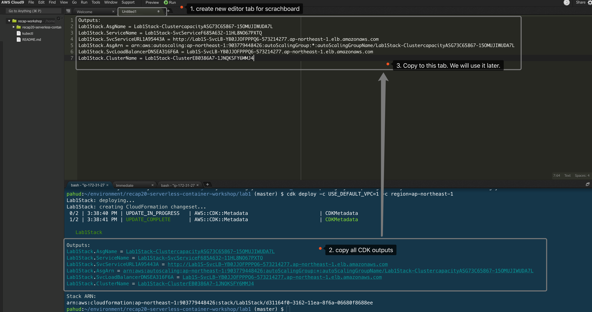


Go to the [Amazon ECS console](https://ap-northeast-1.console.aws.amazon.com/ecs/home?region=ap-northeast-1#/clusters) for cluster list, select the cluster name **recapTaipei2020WorkshopStack-xxxxxxxxx**


Update the service

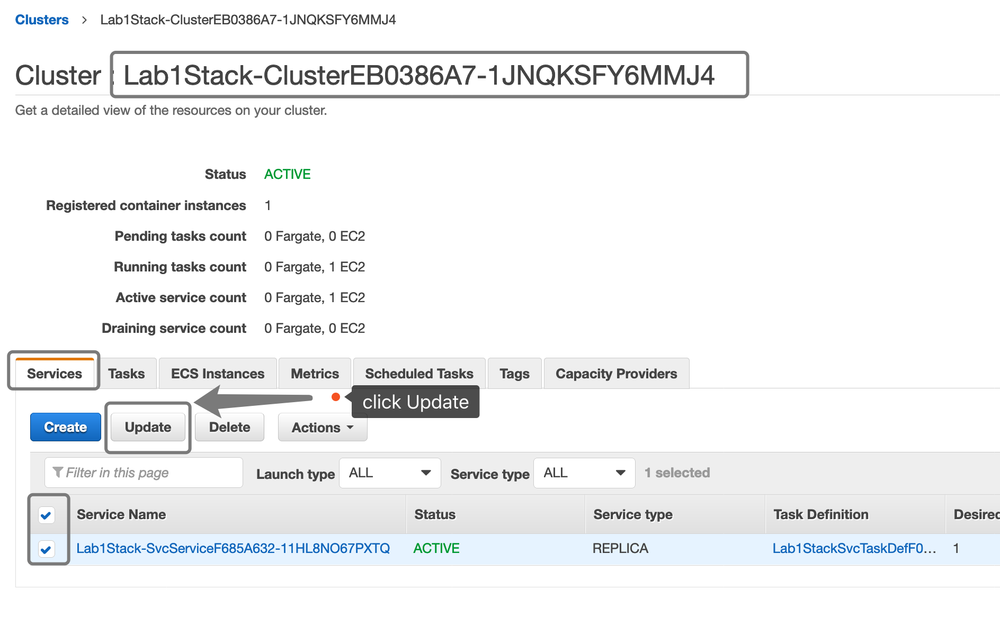

Set desired number of tasks to **5** and click next step all the way to update the service.

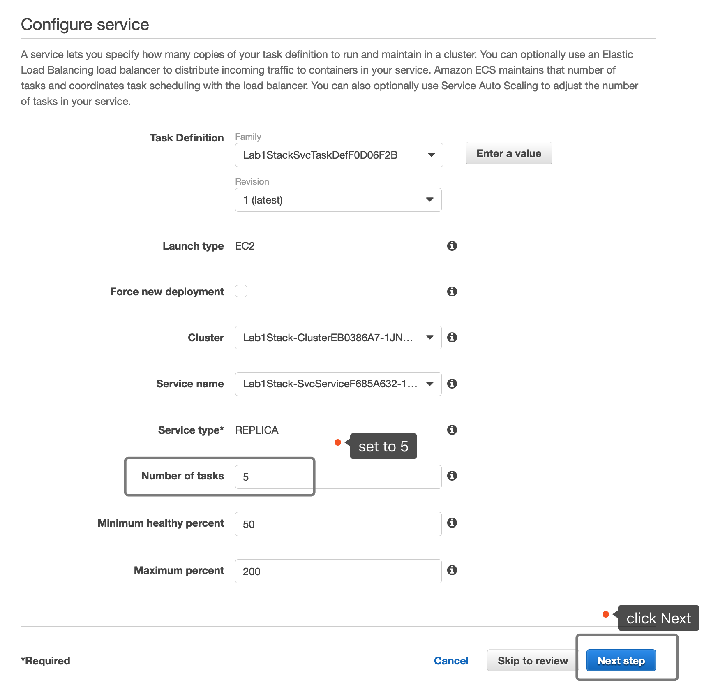


Wait a few seconds and check the service again. There will be only 3 tasks running.

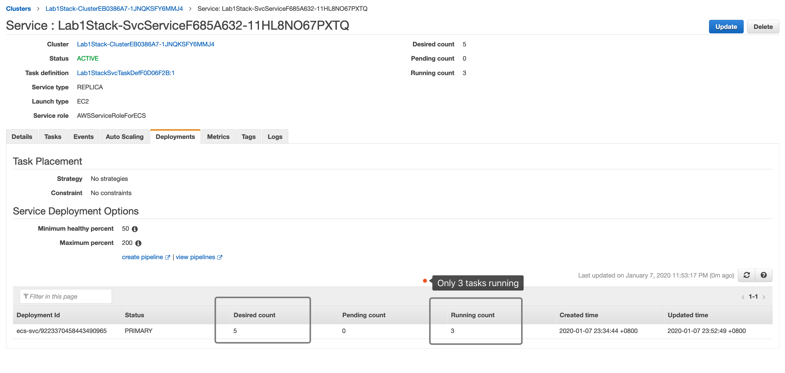

If you check the service **Events** tab, the message indicates insufficient memory.

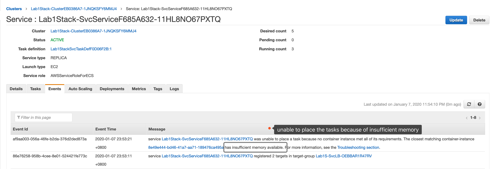


If you check the **Tasks** tab, only 3 **RUNNING** tasks.

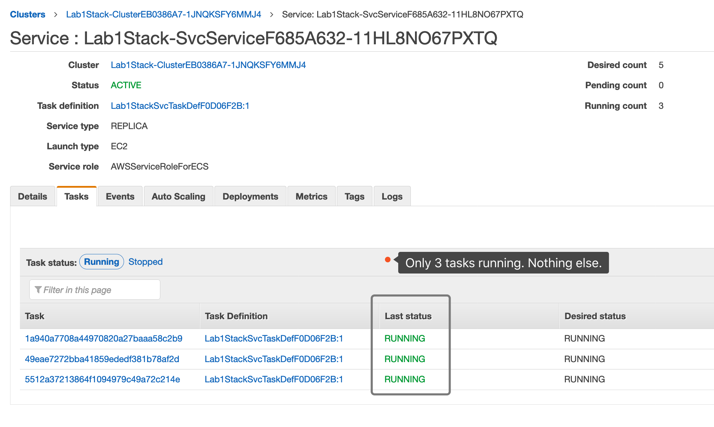


## Enable the CSA(Amazon ECS Cluster Auto Scaling)

OK now let's enable the CSA for this cluster.

In this section, we will create:


1. a default **ASG capacity provider** for the Amazon ECS cluster
2. update the existing ECS service with the ASG capacity provider and define default **capacity provider strategy**


We are going to use the existing ASG for our default ASG capacity provider with Managed AutoScaling and **Managed Termination Protection** when Scale in. To do that,  We need enable  the **Protect From Scale In** for the **Managed Termination Protection** to avoid terminating unexpected instances when scale in.


Go to [Auto Scaling Group console](https://ap-northeast-1.console.aws.amazon.com/ec2/autoscaling/home?region=ap-northeast-1#AutoScalingGroups:view=details;), select the ASG for the **Details**, click the **Edit** button and turn on the Instance Protection with **Protect From Scale In**. Make sure you click **Save**.


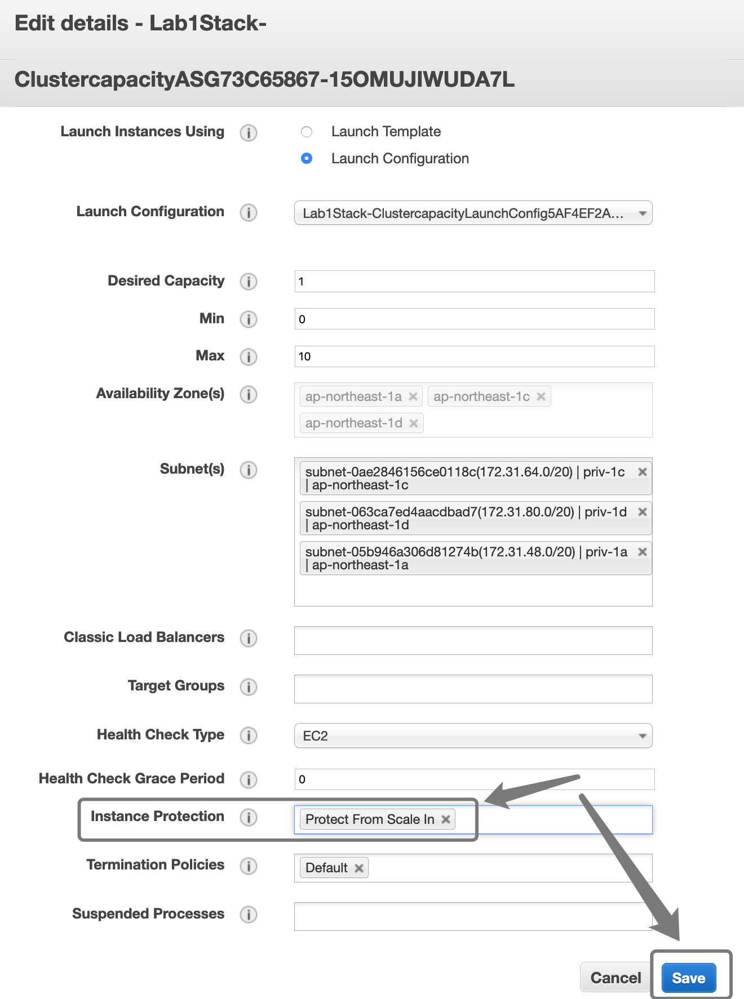

Please note, by enabling **Protect From Scale In** Instance Protection, all new instances created by this ASG afterwards will be protected from scale in, which means all instances will not be terminated by simply ASG scale in, instead, the Amazon ECS CSA will manage the toggle on and off for you and turn off the toggle before it determines to terminate any empty instance to scale in the cluster.

However, as we already have a running instance managed by ASG, we need manually enable the instance scale in protection for once.  Click the **Instances** tab. Select the existing one instance. Click **Actions** drop down menu, select **Instance Protection** -> **Set Scale In Protection**.

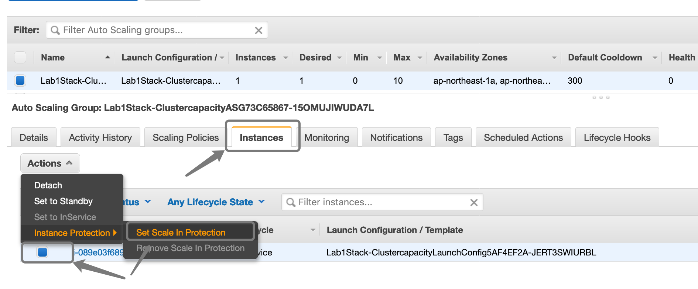


Now let's create the capacity provider from the console. Go back to the ECS cluster **Capacity Providers** tab and click **Create**.


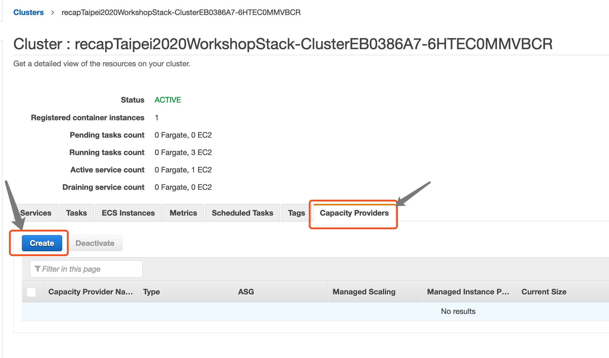


Enter the **Capacity provider name**. Please note as the Capacity Provider at this moment is immutable(aws/containers-roadmap [#632](https://github.com/aws/containers-roadmap/issues/632)), you will not be able to delete it after creation. Make sure you input a unique name. In the following sample, I use the ASG name from the CDK output as the Capacity provider name. You may copy the ASG name from the Cloud9 scratchboard tab.

Enter **100** in the **Target capacity**. 

Click **Create**.


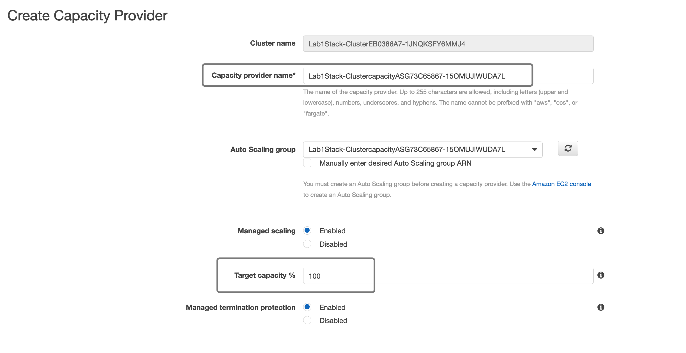

And click **view** the cluster. Now we have a **ASG Capacity Provider** associated with this cluster.

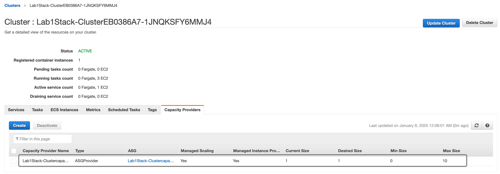


Now we need update the existing Amazon ECS service with the ASG capacity provider and the strategy. We will do it with AWS CLI like this.


```bash
# copy/paste your CLUSTER_NAME, SERVICE_NAME, and ASG_NAME from cdk output
# and make sure you single quote the value
$ CLUSTER_NAME='recapTaipei2020WorkshopStack-ClusterEB0386A7-E3VD3OLNQI5Y'
$ SERVICE_NAME='recapTaipei2020WorkshopStack-SvcServiceF685A632-13HGR69D0RLLS'
$ ASG_NAME='recapTaipei2020WorkshopStack-ClustercapacityASG73C65867-5K4MASAS6736'

# update the service with new capacity provider and strategy
$ aws --region ap-northeast-1 ecs update-service --cluster ${CLUSTER_NAME} \
--service ${SERVICE_NAME} \
--capacity-provider-strategy capacityProvider=${ASG_NAME},weight=1 \
--force-new-deployment
```


Go back to **Tasks** tab and reload the list in the ecs cluster page. As we just **update-service** with **--force-new-deployment**, Amazon ECS control plane will create 5 new tasks with exactly the same task definition and because the service has supported capacity provider now, the 5 new tasks will not immediately go to the STOPPED state due to insufficient resource, instead, they will just go to **PROVISIONING** state and waiting for the capacity provider to provision extra instances.


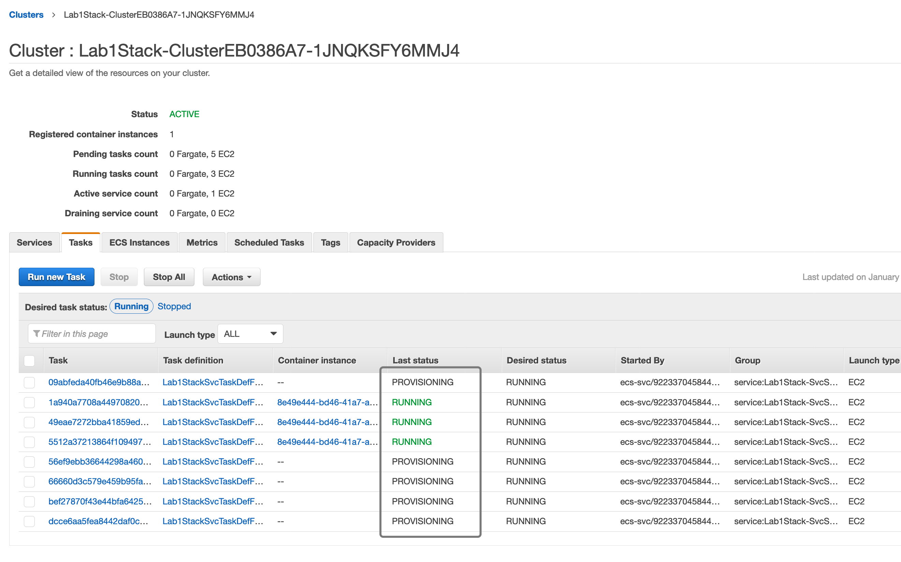


Go to [cloudwatch metrics](https://ap-northeast-1.console.aws.amazon.com/cloudwatch/home?region=ap-northeast-1#metricsV2:graph=~()), select the **AWS/ECS/ManagedScaling** namespace and select the **CapacityProviderReservation** with your cluster name. You will see the metrics just raised gradually from 100 to 150. 


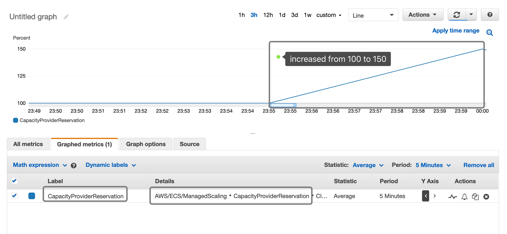


Leave this window open and turn on the **Auto refresh** with an interval of **10 seconds**. Leave this browser tab open.

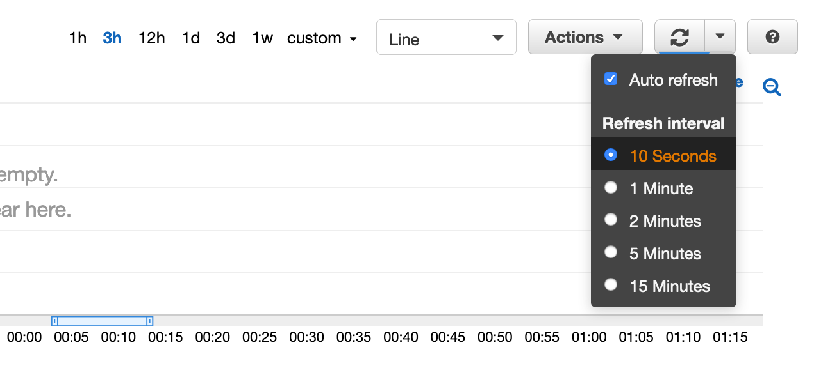


Go back to the **Tasks** tab, 5 tasks will be all in **RUNNING** state in a few minutes. Keep reloading the list if some of them are still in PROVISIONING until all RUNNING.


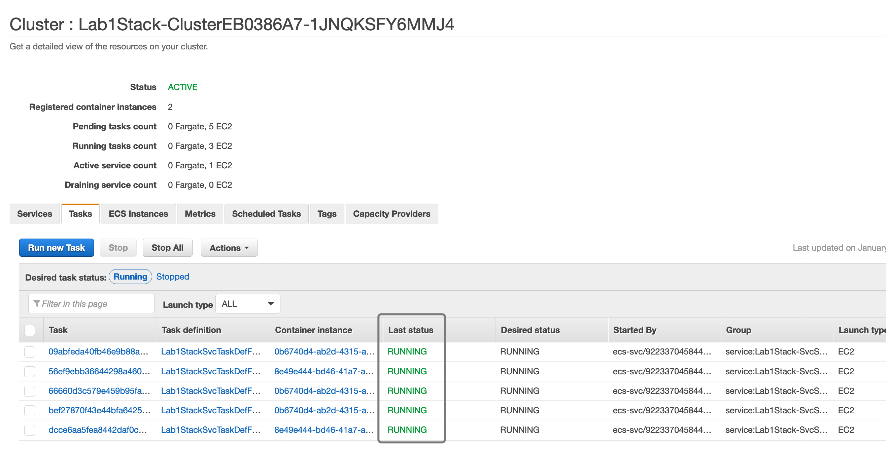


Go back to the **Capacity Provider** tab in the cluster detail, click the reload button and the desired size should have changed from **1** to **2**.

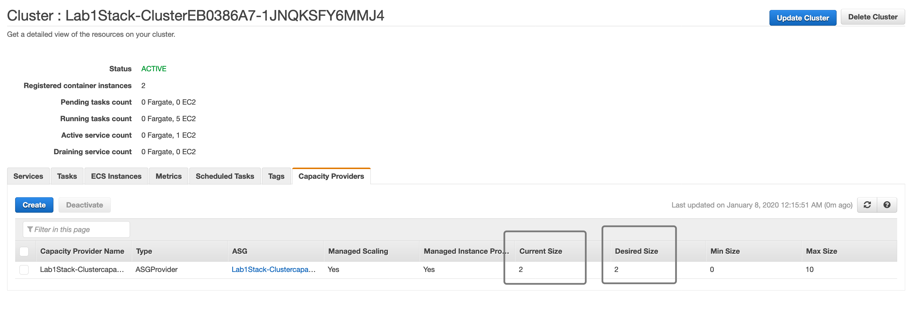


# Self-Paced Practice - Scale In

1. Update the service desired task number from 5 to 1
2. Monitor the **CapacityProviderReservation** metric values and see how Amazon ECS CSA scale in the cluster from two nodes to 1 node.


# Clean up and move to the next Lab

Update the ECS service, set the task number from **5 to 0**. If you check the **CapacityProviderReservation** metric, it should drop from 100 to 0 in a few seconds and eventually the CSA will scale in the cluster to 0, which is the min size of the Capacity Provider.


However, it may take a couple of minutes. Let's just remove the instance scale in protection in the ASG console.


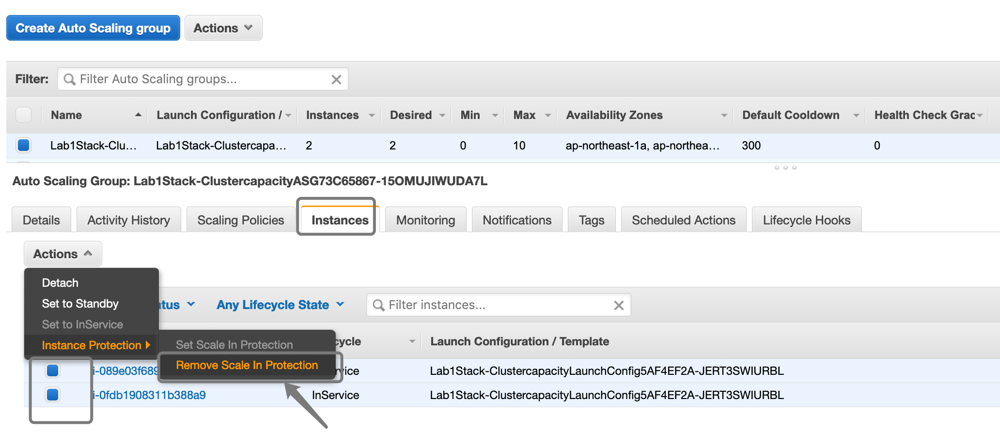


And let's destroy the whole stack with `cdk destroy`


```bash
$ cdk destroy -c USE_DEFAULT_VPC=1 -c region=ap-northeast-1 
```

All resources will be terminated except for the Capacity Provider because at this moment it's immutable. Don't worry, the Capacity Provider is free and will not incure any future cost in your monthly billing.

OK. Let's move to the Lab2. We will walk through the Amazon ECS with Capacity Provider for **FARGATE** and **FARGATE_SPOT**.


# Further Reading

If you are insterested in how it works under the hood, read the following blog post.

**Deep Dive on Amazon ECS Cluster Auto Scaling**  - https://amzn.to/2MZZdP5

